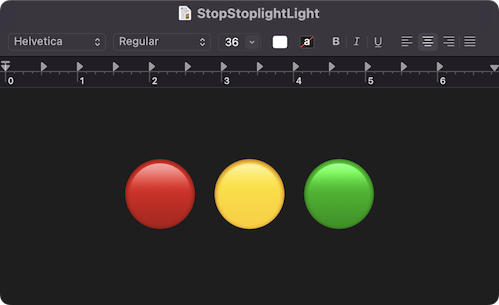

# StopStoplightLight

# Information:

- StopStoplightLight is a MacForge (SIMBL) plugin that hides NSWindow's traffic light buttons
- Tested on Apple silicon macOS 14.1
- Authored by [shishkabibal](https://github.com/shishkabibal)
- Inspired by [INTrafficLightsDisabler](https://github.com/indragiek/INTrafficLightsDisabler)

# Installation:

1. Download [MacForge Apple silicon beta](https://github.com/jslegendre/appcast/raw/master/Beta/MacForge/MacForge.1.2.2-3.zip)
2. Download [TypeTelepathy](https://github.com/shishkabibal/StopStoplightLight/releases/latest)
3. Unzip both downloads
4. Open `StopStoplightLight.bundle` with `MacForge.app`
5. Restart computer

### Appeal:
Repurpose the code any way you like, but please don't just repackage it with your name. Remember to be nice to other people. If you make any changes and want to contribute, feel free to make a pull request.
